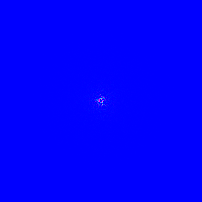

# README

Real-Time Spectral Ocean (Unity) — Work-in-progress ocean rendering that samples a physically-based wave spectrum (JONSWAP/TMA), evolves it in the frequency domain, and reconstructs a height map via GPU IFFTs to displace a mesh in the vertex shader. Runs in real time (≈500 FPS on an RTX 3080).

This project was developed for fun to study rendering complex phenomena on the GPU. This is still a work on progress, but the scene renders the moving ocean. Essentially, the algorithm works as follows: given a 2D plane of points, we can displace each point's y-coordinate in the vertex shader according to a height texture generated each frame representing the ocean height field (this texture is tile-able -> maps any (x,z)-coordinates).

<video controls playsinline muted loop width="100%">
  <source src="Videos/DisplacedMesh.mp4" type="video/mp4">
  Your browser doesn’t support embedded videos. Here’s a
  <a href="Videos/DisplacedMesh.mp4">link to the video</a>.
</video>

## Textures

  
   <em>Figure 1 — JONSWAP spectrum sampled on k-space grid.</em>

  
   <em>Figure 2. Time dependent spectrum using eulers formula.</em>

  
   <em>Figure 3. Heightmap obtained after 2D IFFT on time dependent spectrum.</em>

## Left To Implement

- Fresnel Surface Shading
- Displacement Maps for choppy waves
- Jacobian texture for producing foam maps

## References

https://docs.nvidia.com/cuda/cuda-runtime-api/group__CUDART__OPENGL.html#group__CUDART__OPENGL https://github.com/ndd314/cuda_examples/blob/master/5_Simulations/oceanFFT/oceanFFT.cpp

https://www.diva-portal.org/smash/get/diva2:1778248/FULLTEXT02 file:///C:/Users/sanja/Downloads/GPGPU_FFT_Ocean_Simulation.pdf https://developer.download.nvidia.com/assets/gamedev/files/sdk/11/OceanCS_Slides.pdf

https://docs.nvidia.com/cuda/cufft/ https://arm-software.github.io/opengl-es-sdk-for-android/ocean_f_f_t.html https://arm-software.github.io/opengl-es-sdk-for-android/fftwater_8cpp_source.html https://slembcke.github.io/WaterWaves (Cool Demo) https://www.researchgate.net/publication/264839743_Simulating_Ocean_Water https://david.li/waves/

Inspiration: https://www.youtube.com/watch?v=U2fkrXxvPRY&ab_channel=JS
